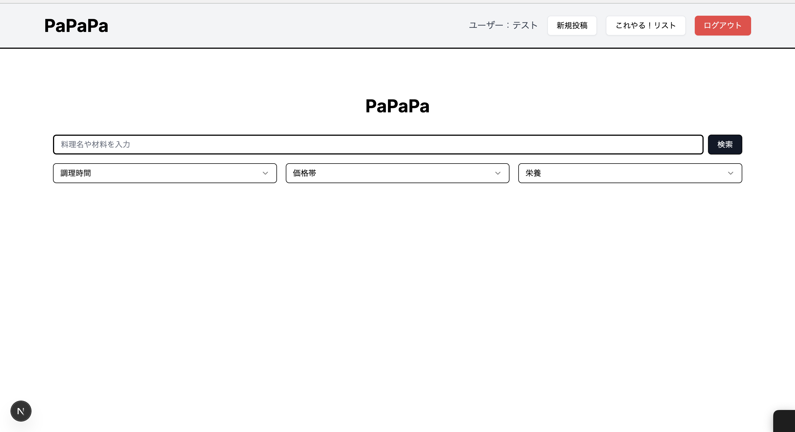

# 若者向けレシピサイト「PaPaPa」 🍳
[](https://github.com/2litrewt/papapa3_repository/actions)
[](https://papapa3-repository-auth.vercel.app)
<br>
<br>
<br>
**アプリURL:** https://papapa3-repository-auth.vercel.app
<br>
<br>
<br>

## 目次
- [概要](#概要)
- [特徴](#特徴)
- [クイックスタート](#クイックスタート)
  - [前提条件](#前提条件)
  - [クローン](#クローン)
  - [フロントエンドのみ](#フロントエンドのみ)
  - [バックエンド](#バックエンド)
  - [Test / Lint](#test--lint)
- [スクリーンショット](#スクリーンショット)
- [Tech Stack](#tech-stack)
- [License](#license)  

## 概要
PaPaPa は「コスト・時間・栄養価」を同時に最適化したい若者向けのレシピ検索アプリです。  
状況（急いでいる・節約したい・栄養を意識したい）に応じて最適レシピを絞り込み、健康的な自炊継続を支援します。  
<br>
  
## 特徴
- 🔐 認証機能：CORSを採用したトークンベースログイン（ヘッダ保存/自動リダイレクト）
- 🥗 レシピ検索：材料・コスト・調理時間・栄養観点でフィルタ
- ⭐ お気に入り管理：ユーザー別の保存・一覧
- 🖼️ 画像アップロード：料理画像の保存（S3相当／外部ストレージ準備中）
- 🔍 高速検索基盤：キーワード／条件組み合わせ
- 📱 レスポンシブ UI（Next.js + Tailwind）
- 🚀 CI/CD：GitHub Actions（Lint/TypeCheck/Jest）→ Vercel Auto Deploy  
<br>

## クイックスタート

### 前提条件
- Node.js 18+
- (Backend API 使用する場合) Ruby 3.2.x & PostgreSQL 14+
- yarn / bundler

### クローン
```bash
git clone https://github.com/2litrewt/papapa3_repository.git
cd papapa3_repository
```

### フロントエンドのみ
```bash
cd front
yarn install
yarn dev
# http://localhost:3000
```

### バックエンド
```bash
cd back
bundle install
cp .env.example .env  # 必要なら
bin/rails db:create db:migrate
bin/rails s
```

### Test / Lint
```bash
cd front
yarn lint && yarn typecheck && yarn test
```
<br>

## 環境変数
```bash
# back/.env.example
DATABASE_URL=postgres://postgres@localhost:5432/papapa3_development
SECRET_KEY_BASE=your_secret_key_here
```
<br>

## スクリーンショット




  
<br>

## Tech Stack
- **フロントエンド:** Next.js 15 · TypeScript · Tailwind CSS  
- **バックエンド:** Ruby on Rails 7.1 · PostgreSQL 14  
- **インフラ & CI/CD:** Vercel · GitHub Actions  
- **テスト:** ESLint · Jest (smoke test) · TypeScript strict


## License
This project is licensed under the [MIT License](LICENSE).
