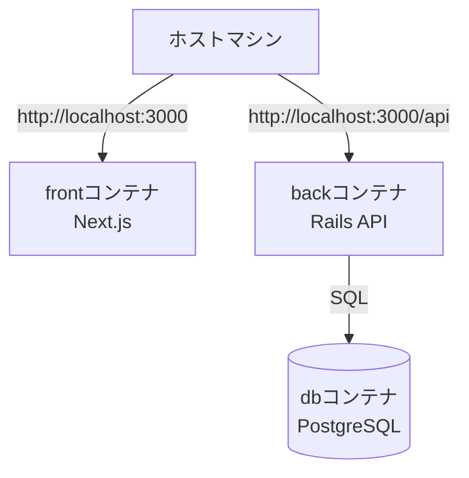

# PaPaPa Backend API

Ruby on Rails 7.1 API-only 構成のバックエンドです。  
Devise Token Auth によるトークン認証と PostgreSQL を使用しています。  
Fly.io でホスティングされています。

## 🚀 セットアップ（ローカル）
```bash
cd back
bundle install
cp .env.example .env
bin/rails db:create db:migrate
bin/rails s
# http://localhost:3000
```

## 🐳 Docker Compose での起動
```bash
docker compose up back db
# http://localhost:3000 で Rails
# http://localhost:5432 で PostgreSQL
```

## 🧩 主な技術
- Ruby on Rails 7.1
- PostgreSQL 14
- Devise Token Auth（トークン認証）
- RSpec（任意）
- Rubocop
- GitHub Actions（CI/CD）

## 📁 主なディレクトリ
- `app/models/` — モデル（User, Recipe, Favorite, RecipeIngredientなど）
- `app/controllers/api/` — APIエンドポイント
- `db/migrate/` — DBマイグレーション
- `config/` — Rails設定

## 🖥️ 開発環境構成図（Docker）



## 📝 備考
- トークン認証は `access-token`, `client`, `uid` をHTTPヘッダに付与する方式です
- Docker Compose で back / db をコンテナ起動します
- Fly.io にデプロイされ、PostgreSQLもFly.io上にホストされています


## 📂 ディレクトリ構成（概要）

```
back/
├── app/
│   ├── controllers/
│   │   └── api/               # APIコントローラ（recipes_controllerなど）
│   ├── models/                 # モデル（User, Recipe, Favorite など）
│   └── serializers/ (任意)     # JSONレスポンス用（未使用なら省略）
├── config/                     # Rails設定（routes.rb, database.yml など）
├── db/
│   ├── migrate/                # マイグレーションファイル
│   └── seeds.rb
├── spec/ (任意)                 # テスト
├── Gemfile
├── Gemfile.lock
└── Dockerfile
```


## 🔍 逆引き：◯◯を変更したい時どこを見る？

| やりたいこと                       | 見る場所 / 補足 |
|------------------------------------|------------------|
| レシピの検索ロジックを変更          | `app/controllers/api/recipes_controller.rb`（条件分岐） + `app/models/recipe.rb` |
| 認証のヘッダや挙動を確認            | Devise Token Auth 設定（`config/initializers/*`） |
| お気に入りの保存仕様                | `app/controllers/api/favorites_controller.rb` + `app/models/favorite.rb` |
| DBのカラム追加                      | `db/migrate/*` → `bin/rails db:migrate` |
| CORS / CSRF / headers の設定        | `config/initializers/cors.rb` / `application_controller.rb` |

## 🌐 Endpoints (API)

| Method | Path               | 概要                 | 認証 |
|--------|--------------------|----------------------|------|
| GET    | `/api/recipes`     | レシピ一覧/検索      | 任意 |
| GET    | `/api/recipes/:id` | レシピ詳細           | 要   |
| GET    | `/api/favorites`   | お気に入り一覧       | 要   |
| POST   | `/api/favorites`   | お気に入り登録       | 要   |

**認証ヘッダ例**（フロントからリクエスト送信時）
```http
access-token: <TOKEN>
client: <CLIENT>
uid: <USER_EMAIL>
```
